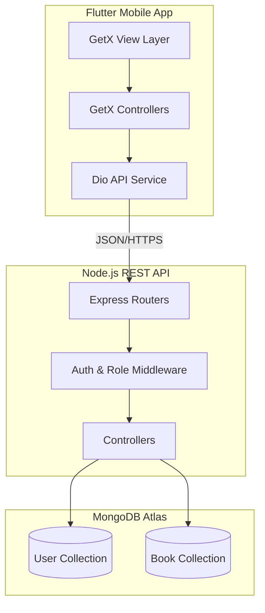

# E-Book Library Management System

A professional, full-stack E-Book application featuring a premium reading experience, robust admin management, and secure role-based authentication.

## 📋 Project Overview
The **E-Book Library Management System** is a high-performance, full-stack digital library solution designed to bridge the gap between premium content and readers. It provides a seamless platform for users to discover, read, and manage books while equipping administrators with robust tools for library oversight, user management, and real-time statistics.

## 📂 Project File Structure

The project is divided into two main parts: `Baxkend` (Node.js/Express) and `E-B` (Flutter).

```text
E-BOOKS/
├── Baxkend/                # Node.js Backend Server
│   ├── src/
│   │   ├── config/         # DB Connection & Env Config
│   │   ├── controller/     # Business Logic (Auth, Book, User)
│   │   ├── middleware/     # Security & Role Validation
│   │   ├── model/          # Mongoose Schemas (User, Book)
│   │   └── router/         # API Endpoint Definitions
│   ├── uploads/            # Storage for PDF & Cover Images
│   └── index.js            # Server Entry Point
├── E-B/                    # Flutter Mobile Application
│   ├── lib/
│   │   ├── api/            # API Services (Dio integration)
│   │   ├── screens/        # UI Layers
│   │   │   ├── Admin/      # Admin Dashboard & Management views
│   │   │   ├── User/       # User Home & Discovery views
│   │   │   ├── auth/       # Login, Signup & Reset views
│   │   │   ├── utils/      # Constants & Theme Colors
│   │   │   └── widgets/    # Reusable UI Components
│   │   └── main.dart       # App Configuration & Routing
│   └── pubspec.yaml        # Flutter Dependencies
└── README.md               # Project Documentation
```

### Key Folders Explained:
- **Baxkend/src/middleware**: Contains `authMiddleware` (JWT verification) and `roleMiddleware` (Admin vs User access control).
- **Baxkend/uploads**: Real-time storage for assets uploaded via the Admin panel.
- **E-B/lib/api**: Contains the `ApiService` which centralizes all network communication using the Dio package.
- **E-B/lib/screens**: Organized by feature to separate Administrative tasks from User discovery tasks.

## ⚡ Quick Setup Guide

### 🛠️ Prerequisites
- **Node.js** (v16+) & **npm**
- **Flutter SDK** (Stable channel)
- **MongoDB** (Local instance or MongoDB Atlas)

### 1️⃣ Backend Setup
1.  Navigate to the backend directory:
    ```bash
    cd Baxkend
    ```
2.  Install dependencies:
    ```bash
    npm install
    ```
3.  Configure Environment Variables:
    - Create a `.env` file in the `Baxkend` root:
    ```env
    MONGO_URI=mongodb://localhost:27017/ebook_app
    JWT_SECRET=your_secret_key
    PORT=3000
    ```
4.  Start the server:
    ```bash
    npm run dev
    ```

### 2️⃣ Frontend Setup
1.  Navigate to the frontend directory:
    ```bash
    cd E-B
    ```
2.  Install Flutter packages:
    ```bash
    flutter pub get
    ```
3.  **API Configuration**:
    - Open `lib/api/api_service.dart`.
    - Update the `baseUrl` with your machine's local IP address (e.g., `192.168.x.x`) to ensure the mobile app can reach the server.
4.  Run the application:
    ```bash
    flutter run
    ```

## 🎯 Core Objectives
*   **Centralized Library Management**: A unified dashboard for administrators to manage digital assets and user permissions.
*   **Premium Interactive Reading**: A high-fidelity PDF reading experience with optimized rendering and state persistence.
*   **Enterprise-Grade Security**: Role-based access control (RBAC) and JWT-driven security to protect sensitive data.
*   **Performance & Scalability**: A modern micro-service-ready architecture built on Node.js and Flutter.

## 🏗️ System Architecture
The project follows a modern three-tier architecture:



## 🛠️ Technology Stack

The **E-Book Library System** is built using a robust and modern technology stack, ensuring high performance, security, and a premium user experience across all platforms.

### 🎨 Frontend (Flutter Mobile App)
- **Framework**: [Flutter](https://flutter.dev/) (Cross-platform UI toolkit)
- **State Management**: [GetX](https://pub.dev/packages/get) (High-performance state and route management)
- **Network Client**: [Dio](https://pub.dev/packages/dio) (Powerful HTTP client for networking)
- **Security**: [Flutter Secure Storage](https://pub.dev/packages/flutter_secure_storage) (Encrypted local storage for JWT tokens)
- **Typography**: [Google Fonts (Poppins)](https://fonts.google.com/specimen/Poppins)
- **PDF Core**: [Flutter PDFView](https://pub.dev/packages/flutter_pdfview) (Native-level document rendering)

### ⚙️ Backend (Node.js REST API)
- **Runtime**: [Node.js](https://nodejs.org/) (Asynchronous event-driven JavaScript)
- **Framework**: [Express.js](https://expressjs.com/) (Fast, unopinionated, minimalist web framework)
- **Database**: [MongoDB Atlas](https://www.mongodb.com/atlas) (Cloud-hosted NoSQL database)
- **ORM**: [Mongoose](https://mongoosejs.com/) (Elegant MongoDB object modeling for Node.js)
- **Security**: 
  - [JSON Web Token (JWT)](https://jwt.io/) (Secure authentication)
  - [Bcrypt.js](https://github.com/kelektiv/node.bcrypt.js) (Industry-standard password hashing)
- **File Handling**: [Multer](https://github.com/expressjs/multer) (Middleware for handling `multipart/form-data`)

### 🛠️ Development & Design Tools
- **AI Augmented Engineering**: [Antigravity/Gemini](https://deepmind.google/technologies/gemini/) (Intelligent code analysis, debugging, and documentation)
- **UI/UX Design**: [Google Stitch](https://stitch.withgoogle.com/) (Premium design patterns and design systems)
- **Version Control**: [Git & GitHub](https://github.com/) (Distributed version control)
- **Architecture Visualization**: [Mermaid.js](https://mermaid.js.org/) (Diagramming and charting tool)

## 🔄 How It Works

The system operates on a seamless interaction between the Flutter frontend and the Node.js backend, categorized into two primary user journeys:

### 👤 User Journey
1.  **Discovery**: Users browse the home screen, exploring categories like *Education*, *History*, or *Islamic stories*.
2.  **Interaction**: Users can add books to their **Favorites** or view their **Reading History** to pick up where they left off.
3.  **Reading**: When a book is selected, the app fetches the secure PDF URL from the backend and renders it using the premium PDF viewer module.
4.  **Persistence**: Every action is saved to the MongoDB database via the authenticated API, ensuring a consistent experience across sessions.

### 🔑 Admin Journey
1.  **Monitoring**: Admins view a specialized dashboard with real-time stats on the total number of books, users, and active reads.
2.  **Library Management**: Admins can upload new e-books (PDFs and Cover Images) which are stored in the cloud/local storage and indexed in the database.
3.  **User Oversight**: Admins have the authority to manage user accounts, update profiles, or resolve access issues directly from the management console.

## � Modern Development Workflow

This project represents a **"human-led, AI-accelerated"** approach to software engineering. The architecture and core features were conceptualized by Mohamed Dahir, who used a suite of advanced tools to ensure professional execution:

- **🎨 UI/UX Design**: The project's visual language and interface were designed using **Google Stitch**, ensuring a clean, modern, and high-performance user experience.
- **💡 AI-Driven Analysis**: AI was utilized strategically throughout the build—not to generate the project blindly, but as a high-level consultant. It was used to analyze system requirements, brainstorm complex features, and provide deep insights into the project's logic.
- **🛠️ Intelligent Debugging**: **Antigravity** and other AI tools were employed to fix technical errors, optimize code blocks, and maintain high security standards.

*While AI provided technical support, all core implementation, design decisions, and architectural logic were led and verified by the human development team.*

## �📱 Frontend

The frontend is built with **Flutter** and follows a Reactively-driven design pattern using **GetX** for state management and dependency injection.

### Core Technologies:
- **GetX**: Handles routing, state management, and dependency injection to keep the UI decoupled from business logic.
- **Dio**: A powerful HTTP client for Dart, configured with base URLs and interceptors for token-based authentication.
- **Google Fonts**: Utilizes 'Poppins' typography for a premium, clean aesthetic.
- **PDF Viewer**: Integrates `flutter_pdfview` for a smooth documents reading experience.

### Main Modules:
1.  **Auth Module**: Handles Login, Registration, and Password recovery. Uses `AuthBinding` to initialize authentication logic.
2.  **User Module**: Focuses on the "Reader's Journey". Includes a personalized home screen, categories, favorites, and the PDF reader.
3.  **Admin Module**: A management-focused interface for adding books, monitoring statistics, and managing user access.

## 🗄️ Database Schema
The system utilizes a NoSQL approach with MongoDB, optimized for fast retrieval and flexible data structures.

### User Schema
| Field | Type | Description |
| :--- | :--- | :--- |
| `fullname` | String | User's full name |
| `username` | String | Unique login identifier |
| `password` | String | Hashed credentials |
| `role` | Enum | `admin` or `user` |
| `favorites` | Array[ObjectId] | References to the Book collection |
| `readingHistory` | Array[Object] | Tracked books with `readAt` timestamps |

### Book Schema
| Field | Type | Description |
| :--- | :--- | :--- |
| `title` | String | Title of the e-book |
| `author` | String | Author of the e-book |
| `category` | Enum | Story, Love, Education, Islamic, History |
| `coverImage` | String | URL path to the hosted cover image |
| `pdfUrl` | String | URL path to the PDF document |
| `rating` | Number | User-assigned or average rating |

## 🚀 API Documentation

### Authentication (`/api/auth`)
*   `POST /signup`: Register a new account.
*   `POST /login`: Authenticate and receive a JWT token.
*   `POST /forgot-password`: Reset user credentials.

### Books (`/api/books`)
*   `GET /`: List all available books (Public).
*   `GET /:id`: Retrieve detailed info for a single book.
*   `POST /`: Add a new book (Admin Only).
*   `PUT /:id`: Update book metadata/files (Admin Only).
*   `DELETE /:id`: Remove a book from the system (Admin Only).

### User Features (`/api/users`)
*   `GET /profile`: Fetch current user info.
*   `POST /favorite`: Add a book to the user's favorites.
*   `GET /history`: View personal reading history.

## 🔑 Authentication Flow
1.  **Request**: User enters credentials in the Flutter App.
2.  **Validation**: Backend verifies username/password and generates a signed JWT.
3.  **Storage**: Flutter App securely stores the JWT using `flutter_secure_storage`.
4.  **Authorization**: Subsequent requests include the Bearer Token in the headers.
5.  **Role Check**: Middleware (`roleMiddleware.js`) validates if the user has permissions for the requested endpoint (e.g., restricted Admin Dashboard).

## 🛡️ Security Implementation

The system implements industry-standard security practices to protect user data and ensure the integrity of the application.

### 1. Authentication (JWT)
- **Mechanism**: Stateless authentication using **JSON Web Tokens (JWT)**.
- **Issuance**: Tokens are generated upon successful login or registration using `jsonwebtoken`.
- **Transmission**: Tokens are sent from the client in the `x-auth-token` header for every protected request.
- **Client Storage**: The Flutter app securely stores the token using `flutter_secure_storage`, which uses KeyChain (iOS) and AES encryption (Android).

### 2. Authorization (RBAC)
- **Role-Based Access Control**: Strict separation between `Admin` and `User` roles.
- **Middleware Protection**: Routes are guarded by `roleMiddleware.js`.
- **Admin Privileges**: Only users with the `admin` role can perform CRUD operations on the book library and manage other users.
- **User Constraints**: Regular users are restricted to discovery, reading, and managing their own favorites/history.

### 3. Data Protection (Hashing)
- **Secure Credentials**: Passwords are never stored in plain text.
- **Bcrypt.js**: Every password is salted and hashed using the `Bcrypt` algorithm with a cost factor of 10 before being saved to the MongoDB database.

### 4. API Security
- **CORS Handling**: Configured `cors` middleware to restrict resource sharing to authorized origins.
- **Environment Isolation**: Sensitive keys like `JWT_SECRET` and `MONGO_URI` are managed via `.env` files and never hardcoded in the source logic.

## 📸 Screenshots
*(Note: Visual assets are located in the `/assets` directory)*

| Login Screen | User Home | Book Reader |
| :---: | :---: | :---: |
|  |  |  |

## 🏁 Conclusion & Future Work
This project represents a professional-level system focusing on real-world implementation, clean architecture, and secure backend development.

**Future Enhancements:**
- [ ] **Push Notifications**: Alert users when new books are added.
- [ ] **Offline Downloading**: Enable downloading books for offline reading.
- [ ] **Social Features**: Reading clubs and book comments/reviews.
- [ ] **Search Engine**: Advanced filtering and full-text search within PDFs.

## 👥 Collaborators & Credits
This project was a collaborative effort by a dedicated team of developers, each contributing to different aspects of the system, from backend architecture to frontend premium UI design.

| Name | Student ID | GitHub Profile |
| :--- | :--- | :--- |
| **Mohamed Dahir Osman** | C1220104 | [@Mohamed28Dahir](https://github.com/Mohamed28Dahir) |
| **Maido Mowliid Hussein** | C1220035 | [GitHub Profile](#) |
| **Abdikadir Ibrahim Hassan** | C1220285 | [GitHub Profile](#) |
| **Abas Mohamed Abdirashid** | C1210534 | [GitHub Profile](#) |

## 🌟 Special Thanks & Mentorship
We would like to extend our deepest gratitude to the following senior developers for their exceptional guidance, technical mentorship, and support in resolving complex architectural challenges during the development of this project:

- **Abdihakin Geedi**: Senior Developer & Technical Advisor.
- **Muz'ab Bashir**: Senior Developer & Architecture Consultant.

Their expertise was pivotal in helping us overcome significant engineering hurdles and ensuring the delivery of a professional-grade system.

<div align="center">
  <p>© 2026 <strong>E-Book Application</strong> - Bridging Hearts through Technology</p>
</div>
